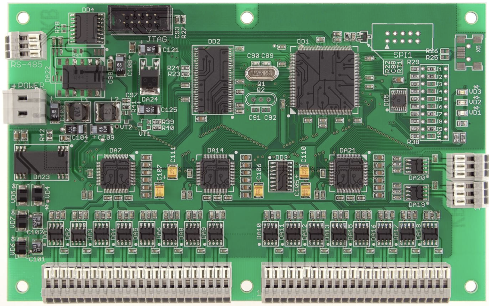
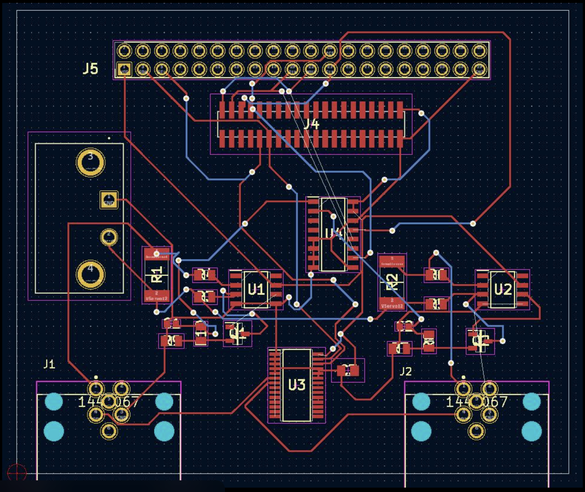
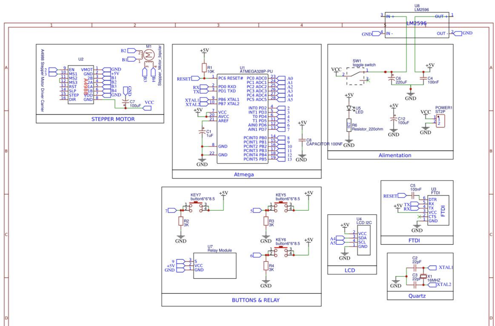
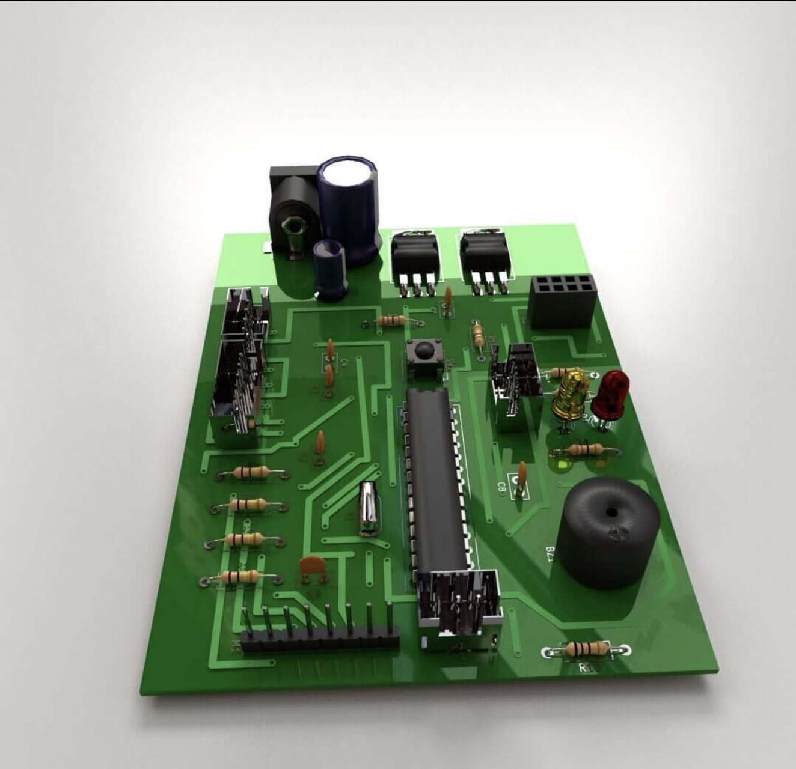

Harika bir fikir, projenin tonunu tamamen değiştirdik. PDF içeriğini, senin istediğin teknik GitHub formatına ve donanım odaklı yapıya tam uyumlu hale getirdim. Aşağıdaki metni doğrudan kopyalayıp GitHub `README.md` dosyana yapıştırabilirsin.

-----

# [cite_start]Blockchain Destekli Akıllı Giriş ve Doğrulama Ekosistemi [cite: 1]

## 📌 Proje Tanımı

[cite_start]Bu proje, geleneksel merkezi güvenlik sistemlerindeki insan hatasını ve veri manipülasyonu risklerini ortadan kaldırmak amacıyla geliştirilmiş, **blockchain tabanlı bir akıllı giriş ve doğrulama platformudur**[cite: 1, 9].

[cite_start]Sistem, güvenlik süreçlerini insan yorumuna değil, **değiştirilemez matematiksel kanıtlara** ve kriptografik kayıtlara dayandırarak yönetir[cite: 18, 21].

**Amaç:**

  * [cite_start]Güvenliği merkezi otoritelerden alıp dağıtık bir güven ağına taşımak[cite: 20].
  * [cite_start]Giriş-çıkış süreçlerini otomatikleştirerek operasyonel verimliliği artırmak[cite: 111].
  * [cite_start]Veri manipülasyonu ve kayıt silme risklerini matematiksel olarak imkansız hale getirmek[cite: 113].
  * [cite_start]Site sakinlerine modern ve prestijli bir yaşam standardı sunmak[cite: 118].

-----

## 🔍 Sistem Donanım Görselleri

Sistemin kalbinde yer alan, kriptografik doğrulama yapan IoT kontrol ünitesinin tasarım detayları aşağıdadır:

### 🧩 PCB Tasarımı

\<p align="center"\>
\
\</p\>

-----

### ⚙️ PCB Yerleşim (Routing)

\<p align="center"\>
\
\</p\>

-----

### 🔬 Devre Şeması

\<p align="center"\>
\
\</p\>

-----

### 🧠 Donanım Modeli (3D)

\<p align="center"\>
\
\</p\>

-----

## 🚨 Problem Tanımı

Günümüz site yaşamındaki geleneksel güvenlik yöntemleri ciddi zafiyetler barındırmaktadır:

  * [cite_start]**İnsan Faktörü:** Unutkanlık, yetki aşımı ve sahte kimliklerin tespit edilememesi[cite: 11].
  * [cite_start]**Merkezi Veritabanı Riskleri:** Siber saldırılarda tek nokta çökmesi (Single Point of Failure) ve geriye dönük veri manipülasyonu tehlikesi[cite: 13, 14].
  * [cite_start]**Operasyonel Karmaşa:** Uzayan bekleme süreleri, manuel misafir kayıtları ve maliyeti yüksek süreçler[cite: 5, 6].

-----

## 💡 Çözüm

[cite_start]Bu sistem, güvenliği "zayıf halka" olan insan ve merkezi sunuculardan kurtararak **blockchain mimarisine** emanet eder[cite: 15, 21].

  * [cite_start]**Dinamik QR Doğrulama:** Site sakinleri uygulama üzerinden kurye veya misafir için sınırlı süreli, kriptografik QR kodlar oluşturur[cite: 30].
  * [cite_start]**Immutable Ledger (Değiştirilemez Defter):** Her giriş denemesi zincire "hash"lenmiş bir kayıt olarak işlenir; silinemez ve değiştirilemez[cite: 38].
  * [cite_start]**Otonom Onay:** Akıllı sözleşmeler, zaman damgalı izni yönetici müdahalesi olmadan saniyeler içinde doğrular[cite: 32, 33].

-----

## ⚙️ Sistem Mimarisi

```text
[Mobil Uygulama (Dinamik QR)]
        ↓
[IoT Geçiş Terminali (QR Okuyucu)]
        ↓
[Blockchain Doğrulama (Smart Contract)]
        ↓
[Merkeziyetsiz Kayıt (Immutable Hash)]
        ↓
[Kapı / Bariyer Kontrol (ESP32 / Röle)]
        ↓
[AI Destekli Yönetici Paneli (Analitik)]
```

-----

## 📊 Yönetici Paneli ve Analitik

[cite_start]Sistem, toplanan verileri yönetici paneli üzerinden anlamlı içgörülere dönüştürür[cite: 47, 48]:

  * [cite_start]**Gerçek Zamanlı Yoğunluk:** Site içindeki insan ve araç trafiğinin anlık takibi[cite: 49].
  * [cite_start]**Genel Risk Puanı:** Şüpheli aktivitelerin analizi ile belirlenen güvenlik skoru[cite: 57].
  * [cite_start]**Davranış Analitiği:** Aynı kodla mükerrer giriş denemesi gibi riskli durumların anlık uyarısı[cite: 65, 74].

-----

**Bu README dosyasını hazırladığımıza göre, bir sonraki adımda blockchain tarafındaki "akıllı sözleşme" (Smart Contract) mantığını mı inceleyelim, yoksa donanım bileşenlerini mi detaylandıralım?**
